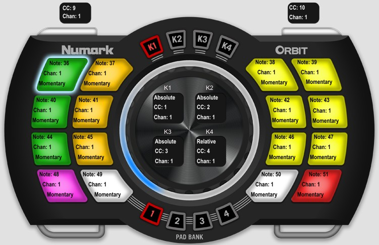

# webMidi para usar Numark Orbit con Hydra

** Esta implementación surge de la pregunta sobre las posibilidades de usar webMidi en diferentes controladores midi para usar con hydra.

MIDI: Musical Instrument Digital Interface
MIDI es un estándar tecnológico que describe un protocolo, una interfaz digital y conectores que permiten que varios instrumentos musicales electrónicos, ordenadores y otros dispositivos relacionados se conecten y comuniquen entre sí.

HYDRA
Conjunto de herramientas para la codificación en vivo de imágenes en red. Inspiradas en los sintetizadores modulares analógicos, estas herramientas son una exploración del uso de la transmisión por Internet para enrutar fuentes y salidas de video en tiempo real.

Hydra usa múltiples framebuffers para permitir mezclar, componer y colaborar dinámicamente entre flujos visuales de navegador conectados. Las transformaciones de coordenadas y colores se pueden aplicar a cada salida a través de funciones encadenadas.

Nota: experimental/en desarrollo.

Para obtener más información, consulte la introducción, el pdf de introducción, los tutoriales y ejemplos, la lista completa de funciones, la galería de bocetos generados por los usuarios o una charla sobre las motivaciones para crear Hydra.

Referencias:

* https://github.com/hydra-synth/hydra

* https://github.com/hydra-synth/hydra/blob/main/docs/midi.md

* https://www.w3.org/TR/webmidi/

* https://www.midi.org/specifications-old/item/table-2-expanded-messages-list-status-bytes

* https://github.com/Athaphian/web-midi-launchpad

* Video para configurar los colores apenas arranca el controlador, se puede en los 4 canales (Pad Bank)

https://www.youtube.com/watch?v=wd5Pv-2h9xs

* Diagrama MIDI Numark ORBIT

Generalidades:

- Se debe correr el código en la consola del navegador donde se vaya a usar hydra.

- Se pueden usar los 64 pads (16 por pad bank) tanto para la carga de videos como para la ejecución de código. El acelerómetro en X y Y se puede usar de acuerdo a la función que se defina en los pads.
